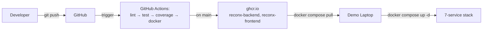

# ReconX — Enterprise Trade Reconciliation Platform

Enterprise-grade trade reconciliation platform built with **Spring Boot, Kafka, PostgreSQL, React, Prometheus, and Grafana**. ReconX ingests trade events, performs reconciliation, stores audit data, exposes REST APIs, and provides production-style monitoring. The project demonstrates a modern microservice architecture with automated CI/CD and containerized deployment.

---

## Quick start

Bring the complete platform up in under a minute.

```bash
echo $GHCR_PAT | docker login ghcr.io -u <github-username> --password-stdin
docker compose pull
docker compose up -d
```

Open **http://localhost:5173**

Login:

- **Email:** `trader@db.com`
- **Password:** `trader123`

---

## Table of contents

- [Architecture](#architecture)
- [Tech stack](#tech-stack)
- [API documentation](#api-documentation)
- [Monitoring](#monitoring)
- [Kafka topics](#kafka-topics)
- [Load test results](#load-test-results)
- [CI/CD pipeline](#cicd-pipeline)
- [Deploy runbook](#deploy-runbook)
- [Default credentials](#default-credentials)
- [Troubleshooting](#troubleshooting)

---

# Architecture

## Runtime architecture

```mermaid
graph TD
    User[Ops Analyst] -->|HTTPS| FE[React + Vite<br/>nginx-alpine]

    FE -->|/api/* proxy| BE[Spring Boot 3<br/>Java 25]

    BE -->|JDBC| PG[(PostgreSQL 16<br/>+ Liquibase)]

    BE -->|KafkaTemplate| K[Apache Kafka<br/>trade-events, recon-results,<br/>system-alerts, DLQ]

    K -->|@KafkaListener| C1[ReconConsumer]
    K -->|@KafkaListener| C2[AuditConsumer]
    K -->|@KafkaListener| C3[AlertConsumer]

    C1 --> PG
    C2 --> PG

    BE -->|/actuator/prometheus| PR[Prometheus]

    PR --> GR[Grafana<br/>dashboards + alerts]
```

## CI/CD + deploy flow



---

# Tech stack

| Layer | Technology |
|--------|------------|
| Frontend | React + Vite |
| Backend | Spring Boot 3 |
| Language | Java 25 |
| Database | PostgreSQL 16 |
| Messaging | Apache Kafka |
| Database Migration | Liquibase |
| Build | Maven |
| Monitoring | Prometheus |
| Dashboards | Grafana |
| Containers | Docker & Docker Compose |
| CI/CD | GitHub Actions |
| Registry | GitHub Container Registry (GHCR) |

---

# API documentation

Swagger UI

```
http://localhost:8080/swagger-ui.html
```

Primary endpoints include:

- Trade reconciliation
- Audit records
- Alert management
- Health checks
- Metrics

---

# Monitoring

The application exports Prometheus metrics through Spring Boot Actuator and visualizes them in Grafana.

### Application dashboard


*Application throughput, latency, and JVM metrics.*

---

### Kafka dashboard


*Kafka producer/consumer metrics and topic activity.*

---

### Infrastructure dashboard


*CPU, memory, container health, and resource utilization.*

---

# Kafka topics

| Topic | Purpose |
|---------|---------|
| trade-events | Incoming trade events |
| recon-results | Reconciliation outcomes |
| system-alerts | Platform alerts |
| DLQ | Failed event processing |

Consumers:

- ReconConsumer
- AuditConsumer
- AlertConsumer

---

# Load test results

Load testing performed using **k6**.

| Metric | Value |
|---------|-------|
| Virtual users | 200 |
| Throughput | *(update with today's results)* |
| Average latency | *(update)* |
| p95 latency | *(update)* |
| Error rate | *(update)* |

---

# CI/CD pipeline

Every push triggers GitHub Actions.

Pipeline stages:

1. Lint
2. Unit tests
3. Coverage (85%+)
4. Docker image build
5. Push to GHCR
6. Deployment via Docker Compose


---

# Deploy runbook

```bash
echo $GHCR_PAT | docker login ghcr.io -u <github-username> --password-stdin
docker compose pull
docker compose up -d
```

---

# Default credentials

**Development profile only**

| Service | Username | Password |
|----------|----------|----------|
| Application | trader@db.com | trader123 |
| Grafana | admin | admin |
| PostgreSQL | postgres | postgres |

---

# Troubleshooting

### Port already in use

```bash
docker compose down
```

or free ports:

- 5173
- 8080
- 5432
- 9090
- 3000

---

### GHCR authentication failed

Ensure the Personal Access Token has:

- `read:packages`

Login again:

```bash
echo $GHCR_PAT | docker login ghcr.io -u <github-username> --password-stdin
```

---

### Kafka listeners are not consuming

Verify:

- Kafka container is healthy.
- Broker address matches `docker-compose.yml`.
- Listener configuration points to the correct bootstrap server.
- Consumer groups have been created successfully.

---

## Team

Built as part of the ReconX enterprise platform project covering backend services, frontend, messaging, observability, CI/CD, and containerized deployment.