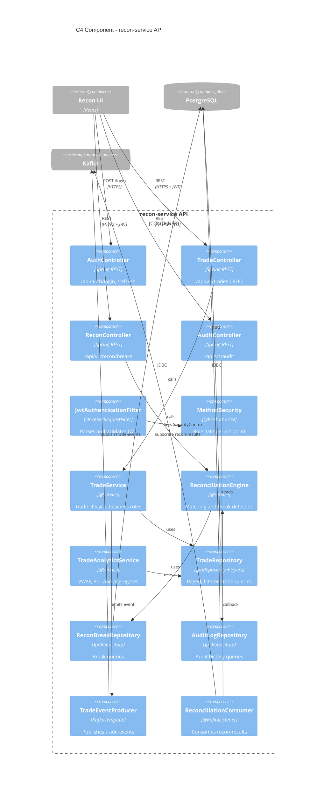

```mermaid
C4Component
title C4 Component - recon-service API

Container_Ext(reactSpa, "Recon UI", "React")
ContainerDb_Ext(postgres, "PostgreSQL")
ContainerQueue_Ext(kafka, "Kafka")

Container_Boundary(api, "recon-service API") {
    Component(authCtl, "AuthController", "Spring REST", "/api/auth/login, /refresh")
    Component(tradeCtl, "TradeController", "Spring REST", "/api/v1/trades CRUD")
    Component(reconCtl, "ReconController", "Spring REST", "/api/v1/recon/breaks")
    Component(auditCtl, "AuditController", "Spring REST", "/api/v1/audit")

    Component(jwtFilter, "JwtAuthenticationFilter", "OncePerRequestFilter", "Parses and validates JWT")
    Component(rbac, "MethodSecurity", "@PreAuthorize", "Role gate per endpoint")

    Component(tradeSvc, "TradeService", "@Service", "Trade lifecycle business rules")
    Component(reconSvc, "ReconciliationEngine", "@Service", "Matching and break detection")
    Component(analyticsSvc, "TradeAnalyticsService", "@Service", "VWAP, PnL and aggregates")

    Component(tradeRepo, "TradeRepository", "JpaRepository + Specs", "Paged, filtered trade queries")
    Component(reconRepo, "ReconBreakRepository", "JpaRepository", "Break queries")
    Component(auditRepo, "AuditLogRepository", "JpaRepository", "Audit history queries")

    Component(producer, "TradeEventProducer", "KafkaTemplate", "Publishes trade-events")
    Component(consumer, "ReconciliationConsumer", "@KafkaListener", "Consumes recon-results")
}

Rel(reactSpa, authCtl, "POST /login", "HTTPS")
Rel(reactSpa, tradeCtl, "REST", "HTTPS + JWT")
Rel(reactSpa, reconCtl, "REST", "HTTPS + JWT")
Rel(reactSpa, auditCtl, "REST", "HTTPS + JWT")

Rel(jwtFilter, rbac, "Sets SecurityContext")
Rel(tradeCtl, tradeSvc, "calls")
Rel(reconCtl, reconSvc, "calls")
Rel(auditCtl, auditRepo, "reads")

Rel(tradeSvc, tradeRepo, "uses")
Rel(reconSvc, reconRepo, "uses")
Rel(analyticsSvc, tradeRepo, "uses")

Rel(tradeRepo, postgres, "JDBC")
Rel(reconRepo, postgres, "JDBC")
Rel(auditRepo, postgres, "JDBC")

Rel(tradeSvc, producer, "emits event")
Rel(producer, kafka, "publish trade-events")
Rel(consumer, kafka, "subscribe recon-results")
Rel(consumer, reconSvc, "callback")
```