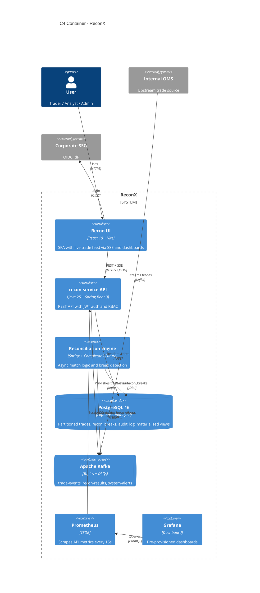

```mermaid
C4Container
title C4 Container - ReconX

Person(user, "User", "Trader / Analyst / Admin")
System_Ext(omsKafka, "Internal OMS", "Upstream trade source")
System_Ext(sso, "Corporate SSO", "OIDC IdP")

System_Boundary(reconxBoundary, "ReconX") {
    Container(reactSpa, "Recon UI", "React 19 + Vite", "SPA with live trade feed via SSE and dashboards")
    Container(api, "recon-service API", "Java 25 + Spring Boot 3", "REST API with JWT auth and RBAC")
    Container(reconEngine, "Reconciliation Engine", "Spring + CompletableFuture", "Async match logic and break detection")
    ContainerDb(postgres, "PostgreSQL 16", "Liquibase-managed", "Partitioned trades, recon_breaks, audit_log, materialized views")
    ContainerQueue(kafka, "Apache Kafka", "Topics + DLQs", "trade-events, recon-results, system-alerts")
    Container(prom, "Prometheus", "TSDB", "Scrapes API metrics every 15s")
    Container(graf, "Grafana", "Dashboard", "Pre-provisioned dashboards")
}

Rel(user, reactSpa, "Uses", "HTTPS")
Rel(reactSpa, api, "REST + SSE", "HTTPS / JSON")
Rel(reactSpa, sso, "Login", "OIDC")
Rel(api, postgres, "Reads + writes", "JDBC")
Rel(api, kafka, "Publishes trade-events", "Kafka")
Rel(reconEngine, kafka, "Consumes trade-events", "Kafka")
Rel(reconEngine, postgres, "Writes recon_breaks", "JDBC")
Rel(omsKafka, kafka, "Streams trades", "Kafka")
Rel(prom, api, "Scrapes /actuator/prometheus", "HTTPS")
Rel(graf, prom, "Queries", "PromQL")
```