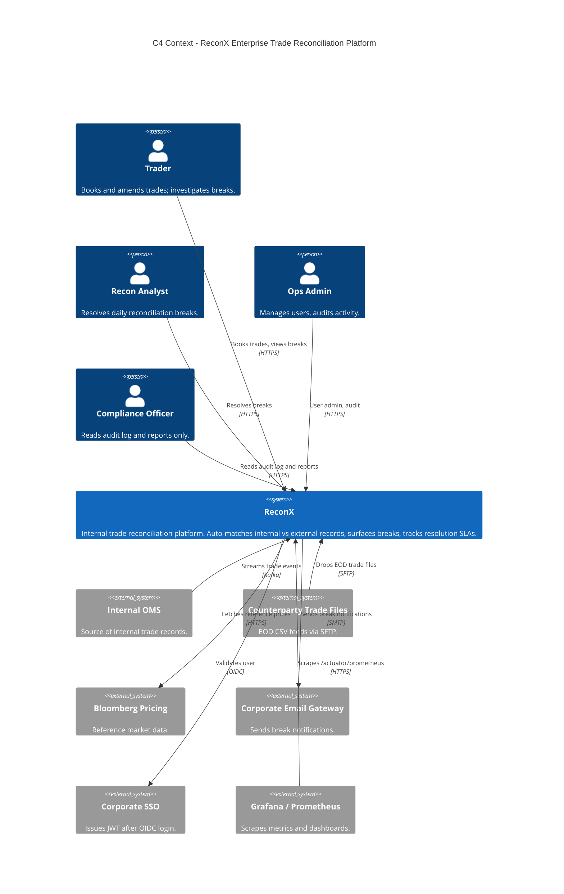

```mermaid
C4Context
title C4 Context - ReconX Enterprise Trade Reconciliation Platform

Person(traderUser, "Trader", "Books and amends trades; investigates breaks.")
Person(reconAnalyst, "Recon Analyst", "Resolves daily reconciliation breaks.")
Person(opsAdmin, "Ops Admin", "Manages users, audits activity.")
Person(complianceUser, "Compliance Officer", "Reads audit log and reports only.")

System(reconx, "ReconX", "Internal trade reconciliation platform. Auto-matches internal vs external records, surfaces breaks, tracks resolution SLAs.")

System_Ext(internalOMS, "Internal OMS", "Source of internal trade records.")
System_Ext(counterpartySFTP, "Counterparty Trade Files", "EOD CSV feeds via SFTP.")
System_Ext(bloombergPricing, "Bloomberg Pricing", "Reference market data.")
System_Ext(emailGateway, "Corporate Email Gateway", "Sends break notifications.")
System_Ext(ssoIdP, "Corporate SSO", "Issues JWT after OIDC login.")
System_Ext(grafana, "Grafana / Prometheus", "Scrapes metrics and dashboards.")

Rel(traderUser, reconx, "Books trades, views breaks", "HTTPS")
Rel(reconAnalyst, reconx, "Resolves breaks", "HTTPS")
Rel(opsAdmin, reconx, "User admin, audit", "HTTPS")
Rel(complianceUser, reconx, "Reads audit log and reports", "HTTPS")

Rel(internalOMS, reconx, "Streams trade events", "Kafka")
Rel(counterpartySFTP, reconx, "Drops EOD trade files", "SFTP")
Rel(reconx, bloombergPricing, "Fetches reference prices", "HTTPS")
Rel(reconx, emailGateway, "Sends break notifications", "SMTP")
Rel(reconx, ssoIdP, "Validates user", "OIDC")
Rel(grafana, reconx, "Scrapes /actuator/prometheus", "HTTPS")
```